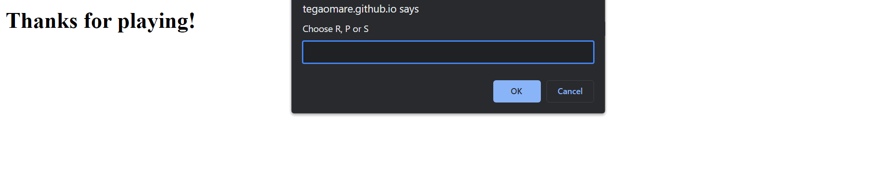

## Description

This is a web apllication game, againt a user and the computer called Rock_Paper_Scissors.

## Installation

1. Clone this repository to your local machine using:
   ```bash
   git clone   git@github.com:tegaomare/Rock_Paper_Scissors.git
Navigate to the project directory:

bash

Copy code

cd horiseon-social-services

Open the index.html file in your preferred web browser.

## Usage
As a user, you input Rock, Paper, Scissors against an automated opponent.

As a user, you expect the computer to choose R, P, or S in return.

As a user, you want the option to play again whether I win or lose.

As a user, you want to see my total wins, ties, and losses after each round.

## Credits
Columbia University Coding Bootcamp

## License
MIT license

## Page link
https://tegaomare.github.io/Rock_Paper_Scissors/